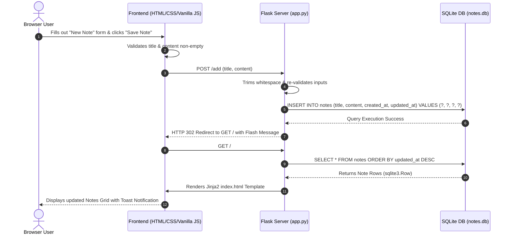

# 📝 Notes Application (Teaching & Reference Guide)

A clean, beginner-friendly Notes web application built using **Python (Flask)**, **HTML/CSS**, **Vanilla JavaScript**, and **SQLite**. 

This repository is designed specifically for students and beginners who are familiar with basic Python, HTML, CSS, and JavaScript, and want to learn how a full-stack web application operates end-to-end—from browser interactions down to database persistence.

---

## 📚 Dedicated Documentation Hub

Full, topic-specific documentation is available in the [`docs/`](file:///home/lebi/ATOM-org/ATOM-26-001-notes-app-for-teaching/docs/INDEX.md) folder:

- 🧠 **[Architecture Guide (`docs/ARCHITECTURE.md`)](file:///home/lebi/ATOM-org/ATOM-26-001-notes-app-for-teaching/docs/ARCHITECTURE.md)**: System design, Mermaid sequence diagrams, and request lifecycle.
- 🚀 **[Setup & Running Guide (`docs/RUNNING.md`)](file:///home/lebi/ATOM-org/ATOM-26-001-notes-app-for-teaching/docs/RUNNING.md)**: Virtual environment setup, server execution, testing & troubleshooting.
- 🛠️ **[Tech Stack Rationale (`docs/TECH_STACK.md`)](file:///home/lebi/ATOM-org/ATOM-26-001-notes-app-for-teaching/docs/TECH_STACK.md)**: Educational reasons behind choosing Flask, SQLite, Jinja2, and Vanilla JS.
- 🗄️ **[Database & Routes (`docs/DATABASE_AND_ROUTES.md`)](file:///home/lebi/ATOM-org/ATOM-26-001-notes-app-for-teaching/docs/DATABASE_AND_ROUTES.md)**: SQLite schema tables, SQL queries, and route reference tables.

---

## 🛠️ Tech Stack & Design Choices


| Layer | Technology | Rationale for Teaching |
| :--- | :--- | :--- |
| **Backend** | Python 3 + [Flask](https://flask.palletsprojects.com/) | Minimal boilerplate; easy to understand routing and request handling without heavy abstractions. |
| **Database** | SQLite via Python's `sqlite3` | Built into Python's standard library. Zero external database configuration required. |
| **Templates** | Jinja2 (Flask built-in) | Demonstrates Server-Side Rendering (SSR) and dynamic data insertion into HTML. |
| **Frontend Styling** | Vanilla CSS3 (Custom Variables) | Teaches modern CSS principles (CSS Grid, Flexbox, Design Tokens) without framework bloat. |
| **Frontend Logic** | Vanilla JavaScript (ES6+) | Direct DOM manipulation, event handling, input validation, and modal dialogs without complex build pipelines. |
| **Environment** | Python Virtual Environment (`venv`) | Standard Python best practice for isolating project dependencies. |

---

## 📁 Project Structure

```text
ATOM-26-001-notes-app-for-teaching/
├── app.py              # Main Flask application (Routes, Controller & DB Access)
├── requirements.txt    # Python dependencies (Flask==3.0.3)
├── .gitignore          # Version control exclusions (venv/, notes.db, cache)
├── README.md           # Exhaustive setup, architecture & teaching reference
├── templates/          # Jinja2 HTML templates rendered by Flask
│   ├── index.html      # Homepage (note card grid, search bar & creation form)
│   ├── edit.html       # Note editing form page
│   ├── note.html       # Single note detailed view page
│   └── 404.html        # Custom 404 error page for missing notes
├── static/             # Static web assets served by Flask
│   ├── css/
│   │   └── style.css   # Modern dark design system & responsive layout
│   └── js/
│       └── script.js   # Client-side JavaScript interactions & input validation
└── notes.db            # SQLite database file (created automatically on app start)
```

---

## 🚀 How to Run the Application

Follow these steps to configure your environment and start the development server.

### 1. Open Terminal or Command Prompt
Navigate into the project directory:
```bash
cd ATOM-26-001-notes-app-for-teaching
```

### 2. Create a Python Virtual Environment (`venv`)
A virtual environment ensures project dependencies don't conflict with your global Python installation.

- **macOS / Linux:**
  ```bash
  python3 -m venv venv
  ```
- **Windows (Command Prompt / PowerShell):**
  ```cmd
  python -m venv venv
  ```

### 3. Activate the Virtual Environment

- **macOS / Linux:**
  ```bash
  source venv/bin/activate
  ```
- **Windows (Command Prompt):**
  ```cmd
  venv\Scripts\activate
  ```
- **Windows (PowerShell):**
  ```powershell
  .\venv\Scripts\Activate.ps1
  ```

*(When activated, your terminal prompt will display a `(venv)` prefix).*

### 4. Install Dependencies
Install the required packages:
```bash
pip install -r requirements.txt
```
> **Note:** SQLite is part of Python's standard library, so no extra database package installation is necessary!

### 5. Launch the Flask Server
Start the development application server:
```bash
python app.py
```

*Upon execution, `app.py` checks for `notes.db`. If the database file does not exist, it creates the database and initializes the `notes` table automatically.*

### 6. Open in Browser
Open your web browser and navigate to:
```text
http://127.0.0.1:5000/
```

---

## 🗄️ Database Schema & Queries

The SQLite database file `notes.db` contains a single table named `notes`.

### Table Definition: `notes`

| Column Name | Data Type | Constraints | Description |
| :--- | :--- | :--- | :--- |
| `id` | `INTEGER` | `PRIMARY KEY AUTOINCREMENT` | Unique identifier for each note. |
| `title` | `TEXT` | `NOT NULL` | The title of the note. |
| `content` | `TEXT` | `NOT NULL` | The main body/content of the note. |
| `created_at` | `TEXT` | `NOT NULL` | Timestamp when the note was created (`YYYY-MM-DD HH:MM:SS`). |
| `updated_at` | `TEXT` | `NOT NULL` | Timestamp when the note was last updated. |

### Parameterized SQL Queries Used in `app.py`

1. **Fetch All Notes**:
   ```sql
   SELECT * FROM notes ORDER BY updated_at DESC;
   ```
2. **Fetch Single Note**:
   ```sql
   SELECT * FROM notes WHERE id = ?;
   ```
3. **Insert Note**:
   ```sql
   INSERT INTO notes (title, content, created_at, updated_at) VALUES (?, ?, ?, ?);
   ```
4. **Update Note**:
   ```sql
   UPDATE notes SET title = ?, content = ?, updated_at = ? WHERE id = ?;
   ```
5. **Delete Note**:
   ```sql
   DELETE FROM notes WHERE id = ?;
   ```
6. **Search Notes**:
   ```sql
   SELECT * FROM notes WHERE title LIKE ? OR content LIKE ? ORDER BY updated_at DESC;
   ```

---

## 🗺️ Application Routes Reference

| HTTP Method | Route Endpoint | Controller Function | Description | Template Rendered / Action |
| :---: | :--- | :--- | :--- | :--- |
| `GET` | `/` | `index()` | Display home page with all notes grid | Renders `templates/index.html` |
| `GET` | `/note/<id>` | `view_note(id)` | View single note in detail view | Renders `templates/note.html` |
| `POST` | `/add` | `add_note()` | Process creation form submission | Redirects to `/` with flash message |
| `GET` | `/edit/<id>` | `edit_note(id)` | Render note edit page with existing data | Renders `templates/edit.html` |
| `POST` | `/edit/<id>` | `edit_note(id)` | Save updated title and content | Redirects to `/` with flash message |
| `POST` | `/delete/<id>` | `delete_note(id)` | Delete note by ID | Redirects to `/` with flash message |
| `GET` | `/search` | `search()` | Search notes by title or content (`?q=...`) | Renders `templates/index.html` with results |

---

## 🧠 Architectural Data Flow



### Complete Request-Response Pipeline Explained:
1. **User Action**: The user fills out a form or clicks an action button in the browser interface.
2. **Frontend Layer**: Client-side JavaScript (`script.js`) intercepts form submissions to check for empty strings, update live character counters, or trigger modal confirmations.
3. **HTTP Transport**: Form data or query arguments are sent via HTTP `GET` or `POST` requests to Flask.
4. **Flask Controller**: `app.py` matches the request path to a route function, validates input data, and invokes modular database helper functions.
5. **Database Execution**: `sqlite3` safely executes parameterized SQL queries against `notes.db`, preventing SQL injection vulnerabilities.
6. **Template Rendering**: Flask injects database records into Jinja2 templates (`templates/index.html`, `templates/edit.html`, or `templates/note.html`), which generate the final HTML markup.
7. **Client View**: The browser renders the HTML markup with modern styles (`style.css`), displaying immediate feedback to the user.

---

## 🔒 Security & Validation Principles

This project enforces core security and robustness practices suitable for teaching full-stack fundamentals:

1. **SQL Injection Prevention**:
   - Every SQL query uses **parameterized placeholders (`?`)**.
   - Input strings are passed as tuples to `sqlite3`, ensuring user inputs cannot alter SQL syntax.
2. **Cross-Site Scripting (XSS) Protection**:
   - Jinja2 automatically escapes HTML variables rendered in templates (e.g. `{{ note['title'] }}`), preventing malicious script injection.
3. **Double-Layer Validation**:
   - **Client-Side Validation**: `script.js` prevents empty form submissions immediately in the browser.
   - **Server-Side Validation**: `app.py` trims whitespace (`strip()`) and verifies inputs on the server to prevent bypasses.
4. **User-Friendly Error Handling**:
   - Raw database exception traces are caught and formatted into clear toast alerts or a custom `404.html` page instead of exposing server internals.

---

## 📄 File Responsibilities Detail

- **`app.py`**:
  - Initializes Flask app and configures `secret_key` for session flashing.
  - Automatically initializes database table (`init_db`).
  - Contains modular CRUD helper functions (`fetch_all_notes`, `fetch_note_by_id`, `insert_note`, `update_note_in_db`, `delete_note_from_db`, `search_notes_in_db`).
  - Defines HTTP routing endpoints and 404/500 error handlers.
- **`templates/index.html`**:
  - Main application dashboard featuring brand header, search bar, collapsible note creation form, empty states, and card grid.
- **`templates/edit.html`**:
  - Pre-populated form template for modifying note titles and contents.
- **`templates/note.html`**:
  - Full-page detail view displaying full creation and modification timestamps.
- **`templates/404.html`**:
  - Clean error page rendered when a user navigates to an invalid note ID or missing URL.
- **`static/css/style.css`**:
  - Central design system defining CSS variables, typography (Inter), glassmorphism navbar, card grids, badges, buttons, modals, and responsive mobile breakpoints.
- **`static/js/script.js`**:
  - Handles client-side UX: dynamic form toggle, character counting, client input validation, and modal confirmation prior to note deletion.
- **`notes.db`**:
  - Persistent SQLite file database.

---

## 🔮 Preparing for Future AI Integration

This codebase is structured specifically to make adding AI services (e.g., automated summary generation, automatic tagging, semantic search, or AI writing assistance) simple in future stages:

- **Decoupled Data Access**: All database operations in `app.py` are isolated into standalone Python functions (`fetch_note_by_id`, `update_note_in_db`, etc.).
- **Modular Routes**: AI endpoints (such as `POST /ai/summarize/<id>` or `POST /ai/expand/<id>`) can easily call these functions and return JSON responses or render updated templates without touching core route logic.

