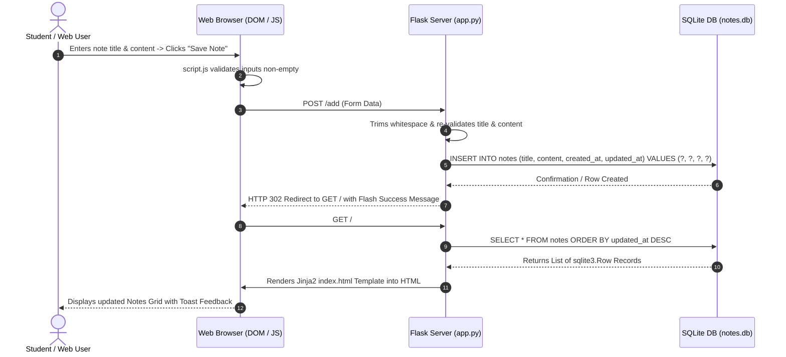

# 🧠 Application Architecture Guide

This document explains the technical architecture, data flow pipelines, request-response lifecycle, and component interactions of the Notes Application.

---

## 🏗️ High-Level System Architecture

The application follows the classic **Model-View-Controller (MVC)** light pattern using Server-Side Rendering (SSR):

```text
               +-------------------------------------------+
               |              Client Browser               |
               | (HTML5 + CSS3 + Vanilla JS UI Layer)      |
               +-------------------------------------------+
                                |          ^
      HTTP Request (GET/POST)   |          | Rendered HTML Response
                                v          |
               +-------------------------------------------+
               |               Flask Controller            |
               |            (app.py Route Handlers)        |
               +-------------------------------------------+
                                |          ^
      Parameterized SQL Queries |          | Data Rows (sqlite3.Row)
                                v          |
               +-------------------------------------------+
               |              SQLite Database              |
               |             (notes.db Engine)             |
               +-------------------------------------------+
```

---

## 🔄 Request-Response Sequence Lifecycle



---

## 🧩 Component Responsibilities

### 1. Presentation Layer (Frontend)
- **`templates/index.html`**: Dashboard layout displaying note cards, search input bar, flash alerts, and note creation modal/form.
- **`templates/edit.html`**: Editing form view pre-filled with note details.
- **`templates/note.html`**: Detailed single-note view displaying full creation and modification timestamps.
- **`templates/404.html`**: Custom 404 page for missing notes or invalid routes.
- **`static/css/style.css`**: Styling system defining CSS custom properties, grid layouts, card hover effects, glassmorphic headers, and mobile responsiveness.
- **`static/js/script.js`**: Vanilla JS script handling client-side form validation, character counter updates, modal popup confirmations, and flash message dismissal.

### 2. Application & Controller Layer (Backend)
- **`app.py`**:
  - Initializes Flask application instance and session secret keys.
  - Automatically initializes SQLite database and table structures on app launch (`init_db`).
  - Implements modular database helper functions (`fetch_all_notes`, `fetch_note_by_id`, `insert_note`, `update_note_in_db`, `delete_note_from_db`, `search_notes_in_db`).
  - Maps incoming HTTP requests to route handler functions.
  - Performs backend validation and formats user-facing flash notifications.

### 3. Data Persistence Layer (Database)
- **`notes.db`**: Local SQLite database file automatically managed via Python's standard `sqlite3` module.

---

## 🔮 Modular Extension for Future AI Capabilities

The architecture intentionally decouples data operations from HTTP presentation logic:

- Database CRUD operations are encapsulated as standalone Python functions in `app.py`.
- Future AI services (e.g. text summarization, auto-tagging, or embedding search) can be integrated by simply adding new helper functions in Python and creating dedicated API endpoints (e.g. `POST /ai/summarize/<id>`) without restructuring existing note features.
